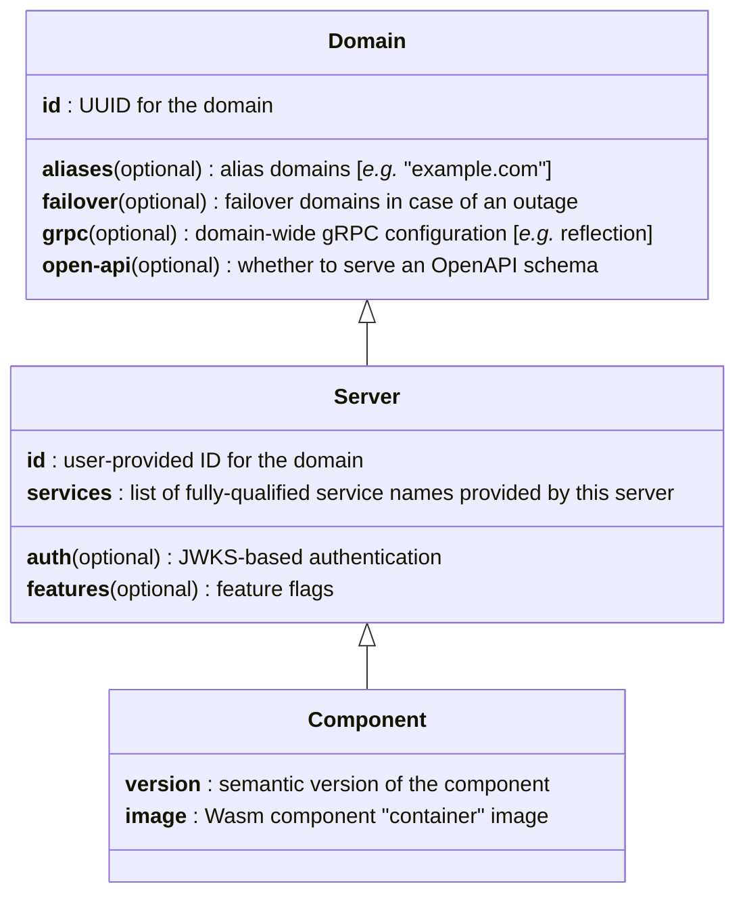

# Vimana

[](https://github.com/vimana-cloud/vimana/actions/workflows/unit-tests.yaml)

Vimana is an experimental "container" runtime and Kubernetes API
for running modern web services
built from extremely lightweight [WebAssembly components].

This project is a **work in progress**.
It is not yet ready for serious use in a production environment.

To get started using Vimana, see the [Developer Setup].

[WebAssembly components]: https://component-model.bytecodealliance.org/
[Developer Setup]: docs/get-started.md

## Running Services

Vimana is all about running *services*.
Those could be [gRPC] services, HTTP/JSON services, JSON-RPC services,
or potentially other types of services that can be [defined in Protobuf].

Kubernetes has long facilitated running [services] at scale,
but Vimana leverages Wasm to provide a higher level of abstraction,
more advanced built-in features,
and a far more efficient runtime for FaaS-style use-cases.

Vimana consists of 3 principle parts:

1. The [Protobuf compiler plugin],
   which converts Protobuf service definitions to WIT interfaces
   so that server implementations can be compiled as Wasm components.
2. The [runtime], which runs the compiled components as K8s pods.
3. The [K8s operator] providing an ergonomic API
   to spin up and manage Vimana services.

[gRPC]: https://grpc.io/
[defined in Protobuf]: https://protobuf.dev/programming-guides/proto3/#services
[services]: https://kubernetes.io/docs/concepts/services-networking/service/
[Protobuf compiler plugin]: compiler/
[runtime]: runtime/
[K8s operator]: operator/

## Images

Vimana uses specialized server images that are similar to [Wasm OCI artifacts].

See the [compiler documentation] for more information on how to compile a Vimana image.

[Wasm OCI artifacts]: https://tag-runtime.cncf.io/wgs/wasm/deliverables/wasm-oci-artifact/
[compiler documentation]: compiler/README.md

## API

Vimana provides three Kubernetes [custom resource definitions] (CRDs)
to manage services.
These CRDs strike a balance between simplicity and expressivity.

<details>
<summary style="cursor:pointer"><strong>CRD Class Diagram</strong></summary>



</details>

Custom resource definitions can be found under [`operator/config/crd/bases/`].
For simple examples of each resource, see [`mvp.yaml`]

[custom resource definitions]: https://kubernetes.io/docs/concepts/extend-kubernetes/api-extension/custom-resources/
[`operator/config/crd/bases/`]: /operator/config/crd/bases/
[`mvp.yaml`]: /e2e/mvp.yaml

### Domains

A `Domain` configures *where* to run a service,
as well as certain settings that span across `Server` boundaries,
such as whether to provide an OpenAPI schema or gRPC reflection
at the domain level.

It is also the basic unit of developer access control,
corresponding to a K8s [namespace]
and providing isolation from other domains.

[namespace]: https://kubernetes.io/docs/concepts/overview/working-with-objects/namespaces/

### Servers

A `Server` bundles a set of services
that are implemented, deployed, and upgraded as a unit.
It does **not** necessarily represent a single "machine"
(like a K8s `Pod`).
Rather, it defines the properties of the service(s)
which do not change across version upgrades,
like authentication or feature flags.

### Components

Each `Component` represents a concrete,
versioned implementation of a `Server`.

Multiple components (also referred to as *versions*)
may co-exist at the same time for a given server.
Traffic will be distributed to each version
according to the server's `version-weights`.

Each component references an image,
which is a specialization of an [OCI] container image
that contains a Wasm component
and its associated metadata necessary for the Vimana runtime to function.

[OCI]: https://opencontainers.org/

### Vimanas

Wait, there's a fourth CRD?

At the top of the hierarchy is the `Vimana` resource.
Each `Vimana` essentially maps to a K8s [gateway]
that exposes its constituent services to external traffic.

Multiple `Vimana` resources may co-exist within a cluster,
but typically there is only a single `Vimana` per cluster,
and most developers can get away with sparing it little thought.

[gateway]: https://kubernetes.io/docs/concepts/services-networking/gateway/

## Cluster Provision

### Local

Start a local [minikube] cluster
using the latest local builds of the runtime and operator:

```bash
bazel run //dev/minikube:restart
```

Once the cluster is up, you'll need a tunnel to communicate with it.
This command should probably be running in the background
the whole time the cluster is running.

```bash
minikube tunnel
```

For a minimal example using the running Vimana cluster,
see [`e2e/mvp.yaml`] and [`e2e/mvp.py`].

```bash
bazel test //e2e:mvp-test
```

[minikube]: https://minikube.sigs.k8s.io/
[`e2e/mvp.yaml`]: e2e/mvp.yaml
[`e2e/mvp.py`]: e2e/mvp.py

### Cloud

Vimana aims to make provisioning clusters on various cloud providers as easy as possible,
but currently, only GCP is supported.

To use the GCP backend,
first ensure you have [application default credentials] available on your machine.
The simplest way to do this for a normal Google account is to run:

```bash
gcloud auth application-default login
```

#### Node Image

The first step is to build a node image
with the latest local build of the runtime.
If you own a project with ID `my-project-id`, you can run this:

```bash
bazel run //cluster/node:make-image -- --gcp-project="my-project-id"
```

That script will spin up a temporary GCE instance to build the node image,
then shut the instance down once the image is ready.
The whole process should take about five minutes.

#### Cluster

Profiles provide a convenient way
to keep track of the private details related to cluster management.

If you haven't yet, edit [`cluster/profiles/profiles.yaml`],
replacing `gcp-example-with-custom-node-image.com` with a new name,
*e.g.* `my-cluster.net`
(it *does not* have to be a real domain).
Edit the following fields:

- `state-store` should identify a usable [kOps state store].
  This can be the URI of a Google Storage bucket that you own.
- `project` is the ID of the project that will own the cluster.
  This may or may not be the same as `image-project`.
- `image-project` should be the same project you used to make the node image
  (`my-project-id` in the example above).
- `image-family` should be either `vimana` or `vimana-dirty`,
  depending on whether the node image was created from a clean Git worktree
  (the node image creation script will tell you which to use).
  The cluster will use the latest image within this family.

Once the profile is configured, use it to create your cluster:

```bash
bazel run //cluster:create -- 'my-cluster.net' # or whatever you named it
```

You can interact with the new cluster using `kubectl`.
Once you're done with it:

```bash
bazel run //cluster:destroy -- 'my-cluster.net'
```

[application default credentials]: https://cloud.google.com/docs/authentication/application-default-credentials
[`cluster/profiles/profiles.yaml`]: cluster/profiles/profiles.yaml
[kOps state store]: https://kops.sigs.k8s.io/state/
