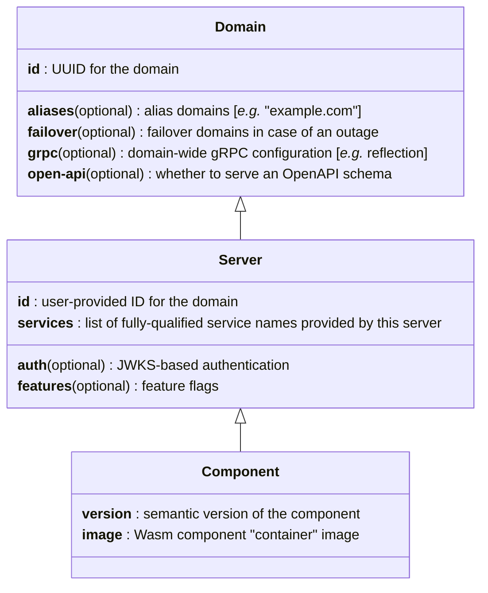

# API

Vimana is all about running *services*.
Those could be [gRPC] services, HTTP/JSON services, JSON-RPC services,
or potentially other types of services that can be expressed using a [Protobuf service definition].

## Resources

To that end, Vimana provides three Kubernetes [custom resource definitions] (CRDs)
to manage services.
These CRDs strike a balance between simplicity and expressivity.

<strong>CRD Class Diagram</strong>

Custom resource definitions can be found under [`operator/config/crd/bases/`].
For simple examples of each resource, see [`mvp.yaml`]

[gRPC]: https://grpc.io/
[Protobuf service definition]: https://protobuf.dev/programming-guides/proto3/#services
[custom resource definitions]: https://kubernetes.io/docs/concepts/extend-kubernetes/api-extension/custom-resources/
[`operator/config/crd/bases/`]: /operator/config/crd/bases/
[`mvp.yaml`]: /e2e/mvp.yaml

### Domains

A `Domain` configures *where* to run a service,
as well as certain settings that span across `Server` boundaries,
such as whether to provide an OpenAPI schema or gRPC reflection
at the domain level.

It is also the basic unit of developer access control,
corresponding to a K8s [namespace]
and providing isolation from other domains.

[namespace]: https://kubernetes.io/docs/concepts/overview/working-with-objects/namespaces/

### Servers

A `Server` bundles a set of services
that are implemented, deployed, and upgraded as a unit.
It does **not** necessarily represent a single "machine"
(like a K8s `Pod`).
Rather, it defines the properties of the service(s)
which do not change across version upgrades,
like authentication or feature flags.

### Components

Each `Component` represents a concrete,
versioned implementation of a `Server`.

Multiple components (also referred to as *versions*)
may co-exist at the same time for a given server.
Traffic will be distributed to each version
according to the server's `version-weights`.

Each component references an image,
which is a specialization of an [OCI] container image
that contains a Wasm component
and its associated metadata necessary for the Vimana runtime to function.

[OCI]: https://opencontainers.org/

### Vimanas

Wait, there's a fourth CRD?

At the top of the hierarchy is the `Vimana` resource.
Each `Vimana` essentially maps to a K8s [gateway]
that exposes its constituent services to external traffic.

Multiple `Vimana` resources may co-exist within a cluster,
but typically there is only a single `Vimana` per cluster,
and most developers do not have to think about it.

So, for the sake of oversimplification,
you can often ignore this one.

[gateway]: https://kubernetes.io/docs/concepts/services-networking/gateway/
