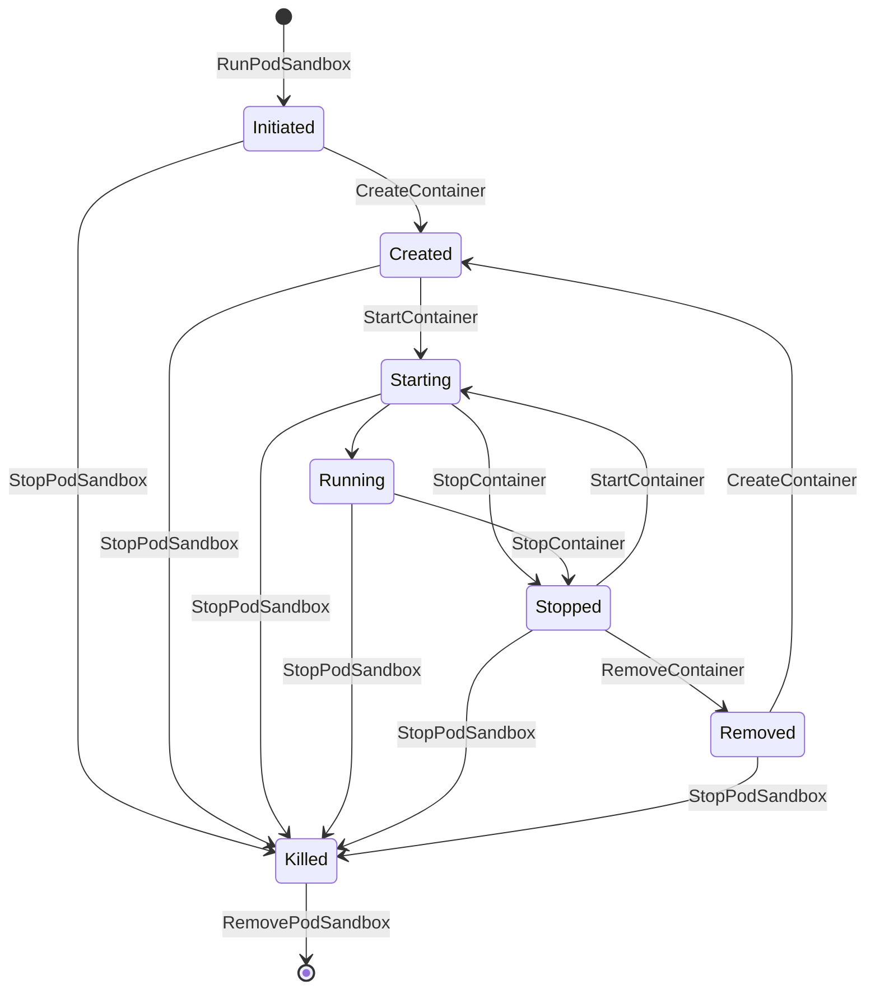

# Work Node Runtime

The Work runtime implements the K8s [Container Runtime Interface] (CRI)
to coordinate running containers with the control plane,
while also listening on on various IP addresses
for gRPC traffic over HTTP/3 (the data plane).

[Container Runtime Interface]: https://kubernetes.io/docs/concepts/architecture/cri/

## Pods and Containers

Unlike more general container runtimes,
the Work runtime maintains a strict 1-to-1 relationship between pods and containers:

- Each pod can have at most a single container.
- The container's ID is equal to its pod sandbox's ID.
- The container's image is pre-determined by its pod sandbox's Vimana labels.

Thus, a pod / container pair is treated as a unit with a finite number of states.
The term "pod" may sometimes be used to refer to an entire pod / container unit.

### State

Work nodes keep track of running pods
in a single global in-memory associative array called the pod pool,
keyed by the pod / container ID.

Each pod can be in one of 7 states:

- `Initiated` - The pod has labels, annotations, and an allocated IP address.
- `Created` - The container has labels, annotations, and environment variables.
  All labels beginning with `vimana.host/` must be identical between the pod / container labels.
- `Starting` - Kubelet has requested to start the container,
  but the runtime is still waiting for the server to be ready.
  The pod will automatically transition to `Running` once the server is ready.
- `Running` - The server is listening and ready to receive data plane traffic.
- `Stopped` - The server has been shut down,
  but it could be re-started on the pod's IP address.
- `Removed` - Functionally equivalent to `Stopped`,
  except the container could be re-created
  with new labels, annotations, or environment variables.
- `Killed` - The pod is no longer usable.
  It's IP address has been freed for re-use by other pods.

Pod state evolves in response to CRI methods according to a state machine:



Here's the same state machine illustrated as a table:

| To →<br />↓ From | `Initiated` | `Created` | `Starting` | `Running` | `Stopped` | `Removed` | `Killed` | ∅ |
|:----------------:|:-----------:|:---------:|:----------:|:---------:|:---------:|:---------:|:--------:|:-:|
|      **∅**       |      ✔      |           |            |           |           |           |          |   |
| **`Initiated`**  |             |     ✔     |     ✘      |           |     ✘     |     ✘     |    ✔     |   |
|  **`Created`**   |             |     ↻     |     ✔      |           |     ✘     |     ✘     |    ✔     |   |
|  **`Starting`**  |             |     ↻     |     ↻      |     ✔     |     ✔     |     ✘     |    ✔     |   |
|  **`Running`**   |             |     ↻     |     ↻      |           |     ✔     |     ✘     |    ✔     |   |
|  **`Stopped`**   |             |     ✘     |     ✔      |           |     ↻     |     ✔     |    ✔     |   |
|  **`Removed`**   |             |     ✔     |     ✘      |           |     ✘     |     ↻     |    ✔     |   |
|   **`Killed`**   |             |     ✘     |     ✘      |           |     ✘     |     ✘     |    ↻     | ✔ |

- ✔ represents a valid state transition.
- ✘ represents an error.
- ↻ indicates that idempotency is supported (the call does not fail but changes nothing)
  as long as all parameters are unchanged.
  Changing any parameter
  (*e.g.* invoking `CreateContainer` twice with different environment variables),
  would result in an error.
- A blank square indicates that the transition is impossible.
- ∅ means the pod does not exist.

### Resource Heirarchy

Vimana's resources can be conceptualized in a heirarchy.

Each container runs a single [component](/docs/glossary.md#component),
but there may be several containers running the same component on a single node.
This leads to two essential ways
the runtime may have to identify a component or individual container:

1. By component name (e.g. `example.com:foo.Bar@1.2.3`).
   This happens when a container is created by the control plane
   (because it most load the component)
   and also when traffic comes in from the data plane
   (because it must identify a pod with the correct component
   to serve that traffic).
2. By pod sandbox ID or container ID (e.g. `example.com:foo.Bar@1.2.3#0`).
   Since Vimana maintains a 1-to-1 relationship between pods and containers,
   these two types of IDs are interchangeable in practice.
   However, the Kubelet will treat them as though they are distinct.
   This kind of identification is only used in the control plane.

To support both kinds of lookups,
the work runtime maintains a single global in-memory map
mapping component names to sets of running containers,
and an "ID map" mapping pod sandbox / container IDs to component names.
Data plane traffic is more performance-sensitive than control plane traffic,
so it makes sense to primarily optimize the component map for reading.
Control plane traffic, on the other hand,
must make do with a 2-layer lookup in order to actual find an individual container,
first looking up the 

### Kubectl commands

```bash
kubectl attach example.com:bar.FooService@1.2.3
```
