# Notes on Kubelet Behavior

Some notes on how the [kubelet] operates
to help with debugging and understanding how the work runtime operates.

[kubelet]: https://kubernetes.io/docs/reference/command-line-tools-reference/kubelet/

## PLEG

A kubelet process called the Pod Lifecycle Event Generator (PLEG)
periodically invokes `ListPodSandbox`, `ListContainers`, and `PodSandboxStatus`
to refresh a cache of information about pod and container statuses.
That cache is used to serve API calls like `kubectl get pods`,
so the load on the container runtime is smooth and independent of K8s API traffic.

Links:

1. Generic PLEG [entrypoint](https://github.com/kubernetes/kubernetes/blob/v1.32.3/pkg/kubelet/pleg/generic.go#L157).

## Container Lifecycles

<!-- TODO: These traffic patterns are still conjecture. Confirm with e2e tests. -->

Starting and stopping a container.

```mermaid
sequenceDiagram
    participant kubelet as kubelet
    participant vimanad as Vimana Runtime
    participant registry as Image Registry

    kubelet ->> vimanad: RunPodSandbox
    vimanad ->> registry: Pull
    activate registry
    vimanad -->> kubelet: Ok
    kubelet ->> vimanad: CreateContainer
    vimanad -->> kubelet: Ok
    kubelet ->> vimanad: StartContainer
    vimanad ->> registry: Load
    registry -->> vimanad: Ok
    deactivate registry
    vimanad -->> kubelet: Ok
    Note left of vimanad: Container is running …

    kubelet ->> vimanad: StopContainer
    vimanad -->> kubelet: Ok
    kubelet ->> vimanad: RemoveContainer
    vimanad -->> kubelet: Ok
    kubelet ->> vimanad: StopPodSandbox
    vimanad -->> kubelet: Ok
    kubelet ->> vimanad: RemovePodSandbox
    vimanad -->> kubelet: Ok
```

